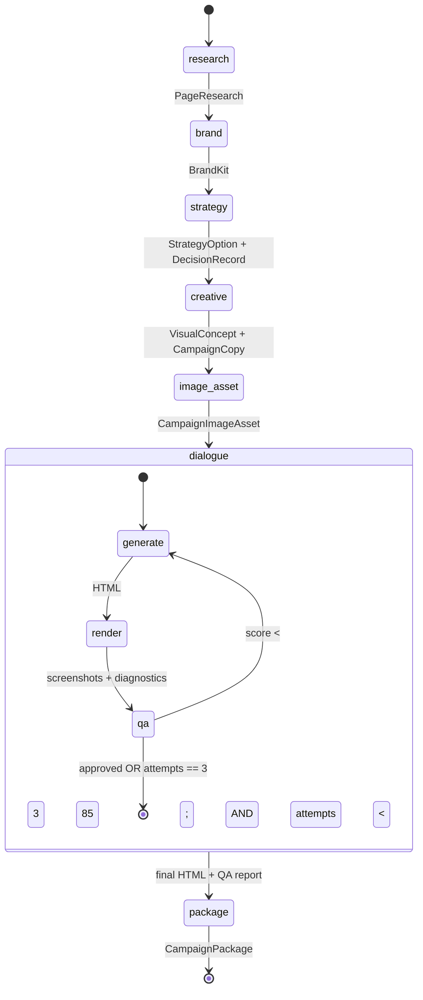

# AdFoundry — Technical Briefing

*A multi-agent, dialogue-driven campaign builder with grounded QA, streaming UX, and human-in-the-loop revision.*

---

## 1. Executive Summary

AdFoundry takes two inputs — a **landing page URL** and a **campaign brief** — and produces a complete creative package: extracted brand identity, scored strategy options, creative direction, copy, a generated hero image, responsive HTML/CSS, and a visual QA report. The novel part is not the output, it is the *process*: eight specialized agents collaborate through a **LangGraph** state machine, the HTML generator and visual QA agent **negotiate via a multi-turn dialogue** grounded in real Playwright renders, every decision is recorded as a first-class artifact, and the entire run streams to the browser token-by-token over SSE. Humans can intervene mid-flight with a revision endpoint whose feedback is injected into the next agent turn as **authoritative input**, not as a "regenerate" button.

**What's novel**
- Dialogue-based agent collaboration (HTML Generator ↔ Visual QA), not a linear pipeline.
- Repair loop grounded in **actual rendered screenshots** from a headless browser, not LLM self-critique.
- Decision trails (`DecisionRecord`) are first-class state, not log lines — built for audit and override.

**Tech foundation**
- LangGraph state machine · OpenAI Responses API (structured outputs, streaming) · Playwright (research + render) · FastAPI + SSE · React/Vite frontend · Pydantic schemas everywhere.

**Status**
- Working end-to-end. Dockerized two-container stack. Streaming UI shipped. HITL revision shipped. Multi-tenant per-request credentials shipped.

> **Speaker note:** Open with a 30-second framing: "I built this to explore what happens when you treat agents as a *production team* with explicit roles, a real artifact to inspect, and a way for humans to step in. Most of what I want to show you is how the agents talk to each other and how the user watches them think."

---

## 2. The Problem, and Why Agents

Creative campaign production is one of the rare LLM use cases where the agent metaphor is not a wrapper around a single prompt. The work has **natural specialist roles** — brand analyst, strategist, creative director, copywriter, HTML developer, visual QA — and each role produces a typed artifact that downstream roles consume. It needs **explainable choices** because brand teams will not ship copy they cannot defend. And critically, it has a **groundable QA step**: you can render the artifact in a real browser and let an LLM critique the rendered pixels and DOM, instead of asking an LLM "is this good?" in the abstract.

That last point is the unlock. Most "self-critiquing" agent systems ask the model to inspect its own output as a string. AdFoundry instead serializes the HTML, hands it to Playwright, captures desktop and mobile screenshots plus DOM diagnostics, and feeds those back to a Visual QA agent that scores six dimensions (visual quality, brand consistency, readability, CTA visibility, responsive layout, accessibility). The Generator then reads the QA verdict, **including specific screenshot evidence**, and rewrites. Because the feedback is grounded in a real render, the agents converge on quality instead of agreeing with themselves.

> **Speaker note:** If you only emphasize one thing, emphasize this — "we don't ask the LLM if the HTML is good, we render it and let the LLM look at the pictures." That pattern generalizes far beyond ads.

---

## 3. High-Level System Architecture

```mermaid
graph LR
    subgraph Browser["Browser (React + Vite + Tailwind)"]
        UI[Setup / Home / Run pages]
        SSE[SSE EventSource]
    end

    subgraph Edge["Edge"]
        NGX[Nginx<br/>proxies /api/* and SSE]
    end

    subgraph Server["FastAPI Server (Python 3.12)"]
        API[REST endpoints<br/>POST /api/runs<br/>POST /api/runs/&#123;id&#125;/revise<br/>GET  /api/runs/&#123;id&#125;/events]
        WF[LangGraph workflow<br/>CampaignState]
        BUS[RunEventBus<br/>thread-safe pub/sub<br/>+ events.jsonl]
    end

    subgraph External["External Services & Local Browser"]
        OAI[OpenAI Responses API<br/>structured + streaming]
        IMG[OpenAI Images API]
        PW[Playwright Chromium<br/>research + render]
    end

    subgraph Storage["Persistent Storage"]
        VOL[(adfoundry_outputs volume<br/>outputs/&lt;run_id&gt;/<br/>events.jsonl · package.json<br/>screenshots · final HTML)]
    end

    UI -->|fetch| NGX
    SSE -->|text/event-stream| NGX
    NGX --> API
    API --> WF
    WF --> BUS
    WF --> OAI
    WF --> IMG
    WF --> PW
    BUS --> VOL
    WF --> VOL
    BUS -.replay + tail.-> API
    API -.SSE frames.-> SSE
```



The deployment is two containers (`compose.yaml`): `server` runs FastAPI + Playwright Chromium on port 8000; `web` is an Nginx image serving the built React SPA on port 80 and reverse-proxying `/api/*` (SSE included) back to the server. Outputs persist to a named Docker volume so runs survive restarts. `Dockerfile.server` uses `uv sync --frozen` for deterministic installs and `playwright install --with-deps chromium` so the image is self-contained.

> **Speaker note:** Two boring containers. The interesting part is what's inside the `server` box — everything else is just plumbing for streaming events out and keeping the browser thin.

---

## 4. The Agent Cast

Eight specialized agents. Each is a single structured-output call against the OpenAI Responses API with a Pydantic schema; agents are *not* persistent objects with memory — they are functions of `(system prompt, context, schema)` invoked once per workflow node. The dialogue pair at the bottom is the exception: those two agents share a transcript that grows across turns.

| # | Agent | Role | Output schema (file) | Where invoked |
|---|---|---|---|---|
| 1 | **Browser Research** | Open the URL with Playwright; capture desktop + mobile screenshots; extract text, color candidates, logo candidates, image assets. | `PageResearch` (`models.py:35`) | `workflow.py:334` `_research_node` |
| 2 | **Brand Analyst** | Interpret brand name, industry, palette, tone of voice, visual style, constraints; score its own confidence honestly. | `BrandKit` (`models.py:59`) | `workflow.py:386` `_brand_node` |
| 3 | **Campaign Strategist** | Propose three meaningfully different campaign angles; score each on five dimensions (brand fit, seasonal relevance, conversion, visual distinctiveness, implementation risk). | `StrategyOption[]` (`models.py:92`) | `workflow.py:449` `_strategy_node` |
| 4 | **Decision Board** | Pick a winning strategy and record what was rejected and why. Outputs a `DecisionRecord`. | `DecisionRecord` (`models.py:100`) | `workflow.py:449` (same node, second LLM call) |
| 5 | **Creative Director** | Translate strategy into visual concept, layout, color usage, composition constraints, mood. | `VisualConcept` (`models.py:118`) | `workflow.py:575` `_creative_node` |
| 6 | **Copywriter** | Headline, subheadline, CTA, alternates, rationale. | `CampaignCopy` (`models.py:109`) | `workflow.py:575` (same node) |
| 7 | **Image Director** | Extract candidate images from the landing page, score them, then call OpenAI Images API to generate or edit a hero. Falls back gracefully if image edit is rejected. | `CampaignImageAsset` (`models.py:127`) | `workflow.py:760` `_image_asset_node` |
| 8a | **HTML Generator** | Produce a complete standalone HTML/CSS document. On every turn, also emit `chat_message`, `rationale`, and optional `questions_for_qa`. | `HtmlGeneratorTurn` (`models.py:254`) | `dialogue.py:67` `run_html_qa_dialogue` |
| 8b | **Visual QA** | Score the rendered output on six dimensions, cite screenshot evidence, write `regeneration_instruction` and `answers_to_generator`. | `VisualQaTurn` (`models.py:263`) | same dialogue loop |

System prompts that matter most live at `dialogue.py:38` (`GENERATOR_SYSTEM`) and `dialogue.py:47` (`QA_SYSTEM`). Both explicitly direct the agent to "speak directly" to its counterpart — this is what makes the loop behave like a conversation rather than two independent passes.

> **Speaker note:** Walk the table top to bottom. The pattern to highlight: every agent's output is a typed Pydantic object that the next agent consumes. There's no free-form string handoff anywhere.

---

## 5. Orchestration — the LangGraph State Machine



The outer graph (`workflow.py:313` `build_graph`) is a strict sequential DAG of seven nodes: `research → brand → strategy → creative → image_asset → dialogue → package`. State is a single `TypedDict` named `CampaignState` (`workflow.py:61`) that LangGraph merges across nodes; each node returns a partial dict update.

**Why a DAG and not supervisor-worker?** Because every stage has a well-defined input/output schema and a deterministic next step. Supervisor-worker autonomy would be a liability here — you don't want the brand analyst deciding to skip strategy. The autonomy lives *inside* the dialogue node, where it belongs.

**Decision records as state.** `CampaignState["decisions"]` accumulates `DecisionRecord` objects (`models.py:100`) — `agent`, `decision`, `selected`, `rejected[]`, `reason`, `score`. By the time the run reaches `_package_node` (`workflow.py:966`), that list is a full audit trail of who chose what and why. The frontend renders this as a "Decision Board" panel during and after the run.

> **Speaker note:** The takeaway: the DAG is on purpose. Autonomy is contained inside one node — the QA dialogue — and the rest of the workflow is deliberately boring so it stays debuggable.

---

## 6. The HTML ↔ Visual QA Dialogue Loop

This is the most architecturally interesting part of the system.

```mermaid
sequenceDiagram
    autonumber
    participant G as HTML Generator Agent
    participant PW as Playwright
    participant QA as Visual QA Agent
    participant BUS as RunEventBus

    Note over G,QA: shared transcript; both see prior turns

    G->>BUS: agent_message_started
    G-->>BUS: agent_message_delta (chat_message tokens)
    G->>G: emit HtmlGeneratorTurn<br/>(html, rationale, questions_for_qa)
    G->>BUS: agent_message_completed

    G->>PW: render HTML (desktop 1280, mobile 390)
    PW->>BUS: html_render_started / completed
    PW-->>QA: screenshots + DOM diagnostics

    QA->>BUS: agent_message_started
    QA-->>BUS: agent_message_delta
    QA->>QA: emit VisualQaTurn<br/>(QaReport with 6 scores,<br/>regeneration_instruction,<br/>answers_to_generator)
    QA->>BUS: agent_message_completed
    QA->>BUS: qa_report_completed

    alt score >= ADFOUNDRY_HTML_MIN_SCORE (default 85)<br/>OR attempts == ADFOUNDRY_HTML_MAX_ATTEMPTS (default 3)
        QA-->>G: approved (or hard cap)
        Note over G,QA: exit loop, return best attempt
    else needs repair
        QA-->>G: regeneration_instruction (authoritative)
        G->>G: read critique, regenerate HTML
        Note over G,QA: loop iteration N+1
    end
```

The implementation lives in `dialogue.py:67` (`run_html_qa_dialogue`). A few details worth flagging:

- **Shared transcript.** Both agents see the running conversation as messages — Generator's `chat_message` and rationale appear in QA's context, and QA's report and `chat_message` appear in Generator's context on the next turn. They are not two independent passes.
- **Questions both ways.** `questions_for_qa` on the Generator's schema and `answers_to_generator` on the QA's schema let the agents clarify ambiguity instead of stalemating on it.
- **Hard cap, soft fail.** When `ADFOUNDRY_HTML_MAX_ATTEMPTS` is hit without approval, the system returns the **best-scoring attempt** along with the unresolved QA report. The disagreement is visible to the human, not hidden.
- **Render is real.** `render_campaign_html` in `browser.py` boots an actual Chromium instance, navigates to the HTML, captures screenshots at desktop and mobile breakpoints, and extracts DOM diagnostics (element boxes, viewport overflow). This is what makes the loop converge rather than spiral.

> **Speaker note:** This is the slide to slow down on. "The agents are negotiating, not running through a checklist. And the thing they're negotiating about is a real rendered screenshot, not a string."

---

## 7. Streaming Architecture

```mermaid
sequenceDiagram
    autonumber
    participant OAI as OpenAI Responses API
    participant GW as OpenAIModelGateway<br/>(llm.py:126)
    participant EX as _ChatMessageDeltaExtractor<br/>(llm.py:15)
    participant ND as Workflow node<br/>on_chat_delta callback
    participant BUS as RunEventBus<br/>(events.py:43)
    participant FS as outputs/&lt;id&gt;/events.jsonl
    participant API as FastAPI SSE endpoint<br/>(server.py:310)
    participant UI as Browser EventSource

    OAI-->>GW: streaming JSON tokens (structured output)
    GW->>EX: feed(token)
    Note over EX: parse partial JSON;<br/>emit only the chat_message field
    EX->>ND: on_chat_delta(text)
    ND->>BUS: publish(node_progress, {node, text, kind:"delta"})
    BUS->>FS: append RunEvent as JSON line
    BUS->>API: put on per-subscriber queue
    API-->>UI: SSE frame: event + data payload
    UI->>UI: render token in agent chat panel
```

There are two streaming layers and it's worth being precise about them:

**Layer 1: token-level streaming inside one LLM call.** Because OpenAI's Responses API streams structured output as a JSON document being progressively assembled, naïvely surfacing every delta to the UI would leak braces, field names, and partial values. AdFoundry solves this with `_ChatMessageDeltaExtractor` (`llm.py:15`) — a small stateful parser that reads the JSON stream and emits *only* the text inside the `chat_message` field to the `on_chat_delta` callback. Everything else is buffered for the final structured-output parse. Result: the UI sees natural prose streaming from the agent while the rest of the typed schema is built silently.

**Layer 2: event streaming across the whole run.** `RunEventBus` (`events.py:43`) is a thread-safe pub/sub with append-only JSONL persistence. Every workflow node publishes events of fifteen types (`events.py:13`): `run_started`, `node_started`, `node_completed`, `node_progress` (the token deltas), `agent_message_started/delta/completed`, `html_render_started/completed`, `qa_report_completed`, `dialogue_turn_completed`, `revision_started/completed`, `run_completed`, `run_failed`. The SSE endpoint at `server.py:310` subscribes a fresh `queue.Queue` per HTTP client, **replays all prior events from the JSONL file**, then tails the live queue. That means a user can reload mid-run and pick up exactly where they left off.

> **Speaker note:** Two layers. Token streaming is for "I see the agent thinking right now." Event streaming is for "I see the whole agent team's activity, even if I joined the call late." Both matter.

---

## 8. Human-in-the-Loop Revision

The most recent feature on the branch. `POST /api/runs/{run_id}/revise` (`server.py:258`) accepts a `feedback` string and re-enters the HTML/QA dialogue with the prior transcript loaded.

The mechanics, from `workflow.py:213` `run_revision` and `dialogue.py:195`:

1. Load the completed `CampaignPackage` from disk.
2. Open the event bus in **append mode** so the new events stream into the same `events.jsonl` and any UI client sees one continuous timeline across the original run and the revision.
3. Re-enter `run_html_qa_dialogue` with `prior_messages` (the existing transcript) and `human_feedback`.
4. On the first iteration of the resumed loop, prepend a director-instruction block to the Generator's next prompt:

   > *"Director instruction from the human reviewing the prior result. Treat this as the latest authoritative direction; where it conflicts with earlier QA feedback, follow the Director."*

5. The Generator regenerates with the director's instruction outranking prior QA critique. New turns are merged into the package and re-saved.

The user-facing consequence: revision is **not** a "regenerate the whole campaign" button. It's a continued conversation where the human becomes a third participant whose word overrides the QA agent's. The cost is small (only the dialogue loop reruns, never the upstream agents).

> **Speaker note:** "The human isn't outside the loop pressing buttons — they're inside it as another participant." That framing tends to land well with audiences who care about AI safety and oversight.

---

## 9. Production-Readiness Details

A handful of small but meaningful pieces of engineering polish:

- **Per-request multi-tenant credentials.** `POST /api/runs` accepts optional `provider` (`"openai"` or `"avalai"`) and `api_key` fields. `_resolve_runtime_settings` (`server.py:33`) clones the base Settings and overrides the OpenAI key + base URL for that run only. No env-var rotation, no secret leakage across tenants.
- **Three run modes** (`ADFOUNDRY_RUN_MODE`): `live` requires a key and never falls back; `hybrid` falls back to fixtures on API failure (graceful degradation); `fixture` is fully deterministic for demos and CI.
- **Image-pipeline resilience.** Reference images scraped from the landing page are normalized (resized, format-converted) before being sent to the image-edit endpoint. If the provider rejects a reference edit, the system retries as text-to-image, then falls back to using the highest-scored source image directly.
- **Deterministic builds.** `Dockerfile.server` runs `uv sync --frozen` against a committed `uv.lock`. Playwright Chromium is installed with `--with-deps` so the image is self-contained on a stock Linux host.
- **Non-root container.** The server container runs as user `adfoundry`, not root.
- **Health check.** `GET /api/health` returns 200 with a timestamp; the `web` container's compose dependency waits for the server's health check before accepting traffic.

> **Speaker note:** Don't dwell here — this is the "yes I thought about ops" slide. Spend ten seconds and move on.

---

## 10. Why This Matters for Deriv

*A note up front: I am making educated guesses about Deriv's AI priorities from the outside. Treat this section as a starting point for the conversation, not a research finding.*

Five patterns from AdFoundry that I believe transfer cleanly into the kinds of AI products a regulated, customer-facing financial platform would invest in (trading copilots, onboarding agents, KYC/compliance assistants, marketing automation, support):

- **Decision trails as first-class artifacts.** Every choice is captured as `(agent, selected, rejected, reason, score)` and persisted with the run. In a regulated context this is the difference between "the model said so" and "here is exactly which option was chosen, which were rejected, and why." Reusable for any audit-bearing AI flow.
- **Grounded QA loops.** Don't ask an LLM whether something is correct — produce the artifact, render it in a real environment, and let the LLM critique the result. Applies to: did the SQL return the right shape, did the email render in Outlook, did the trading-signal prompt actually match the live tape, did the KYC summary cite the right document.
- **Streaming-first UX with token-level visibility.** A 60-second agent run is uncomfortable in silence. Showing the agent thinking, one streamed token at a time, with named participants and timestamps, turns latency into engagement. The plumbing (custom JSON-stream extractor + SSE + replay-then-tail) is reusable verbatim.
- **HITL as a participant, not a redo button.** The revision endpoint injects the human's instruction into the agent's next prompt as authoritative input. The same shape works wherever a trader, analyst, or compliance officer needs to override an AI suggestion without restarting the whole flow.
- **Per-request credentials and graceful degradation.** Multi-tenant by construction, with a `hybrid` mode that keeps demos and CI cheap. The provider abstraction (OpenAI vs. AvalAI today, Anthropic and others tomorrow) is bounded to a single ~250-line gateway class.

> **Speaker note:** This is the slide where you tie the demo to their world. Pick the one or two patterns you've heard them care most about and lean into those — skim the rest.

---

## 11. Anticipated Q&A

**Q. Why LangGraph and not LangChain agents / CrewAI / hand-rolled?**
The workflow is a DAG of typed states with deterministic transitions, not a system that needs to figure out which agent to call next. LangGraph gives explicit nodes, explicit edges, explicit state, and a `TypedDict` that LangGraph merges between nodes. Autonomy frameworks (LangChain agents, CrewAI, AutoGen) would add routing autonomy I don't want here — the only place autonomy belongs is inside the dialogue node, and that's a hand-written loop because it has loop-specific concerns (transcript management, hard caps, best-attempt fallback).

**Q. Cost?**
Rough per-run shape for a full live run: ~8 structured-output text calls (research is non-LLM, brand/strategy/decision/visual/copy/image-direction/HTML/QA), plus 1 image generation, plus 1–3 HTML/QA dialogue turns (each is 2 LLM calls + 1 render). Heaviest single cost is image generation. `fixture` mode is free and `hybrid` is free on failure — both are cheap to demo and CI.

**Q. Latency?**
End-to-end ~60–120s for a live run. Browser research is the long pole (page load + screenshots, 5–15s) and image generation adds 10–30s. LLM calls stream, so *perceived* latency is time-to-first-token, which is the metric users actually feel. The streaming UI is doing a lot of work here.

**Q. How do you evaluate quality today, and where would you go?**
Today: deterministic checks plus LLM-based visual QA on rendered screenshots, with a numeric score against a configurable threshold (`ADFOUNDRY_HTML_MIN_SCORE`, default 85). Where I'd take it: a golden-set of briefs with regression scoring, click-through telemetry on shipped variants, and a human-vs-agent agreement metric on the QA scores.

**Q. What if the agents loop forever or argue without converging?**
Hard cap at `ADFOUNDRY_HTML_MAX_ATTEMPTS` (default 3). When hit without approval, the **best-scoring** attempt is returned along with the unresolved QA report — the disagreement is preserved and surfaced to the user, not hidden. A human can then revise.

**Q. Why OpenAI? Not Claude?**
Picked OpenAI for the Responses API's structured-output streaming, which makes the token-level `chat_message` extraction clean. The model gateway is a single ~250-line class (`llm.py:126`); swapping providers is bounded work, and the codebase already supports AvalAI through the same path. Adding Claude is on the roadmap.

**Q. Brand safety / output risk?**
Brand constraints are first-class output of the Brand Analyst (`BrandKit.brand_constraints`) and propagate through every downstream agent prompt. The Decision Board records *which* options were rejected and *why* — generic "gift guide" copy is the most common rejection class. Human revision is always available before publish, and the entire decision trail is in the saved package.

**Q. How would this scale to thousands of concurrent runs?**
Today each run is a background thread with its own event bus and a per-run Playwright session — comfortable for tens of concurrent runs on one server. The scaling path is unsurprising: move workflow execution onto a job queue (Celery / Arq / Temporal), pool Playwright into a browser farm, keep SSE thin in front, and use Redis for the event bus instead of an in-memory queue. Per-request credentials already make the server tier stateless, so horizontal scaling is a deployment concern, not a refactor.

> **Speaker note:** If asked any of these and you don't know — say "I don't know, here's how I'd find out." Don't invent.

---

## 12. Roadmap

Honest list. Positions the work as a foundation, not a finished product.

- **Eval harness.** Golden-set briefs with regression scoring and human-agreement metrics on QA scores.
- **Provider abstraction.** Drop in Claude alongside OpenAI; A/B the same briefs across both.
- **Channel adapters.** Same campaign package → email, social, banner ad variants without re-running the upstream agents.
- **Cost + latency telemetry.** Every event already has a timestamp; the next step is per-node token and dollar accounting visible in the same UI.
- **Persist runs in Postgres.** Filesystem JSONL is great for demos, weak for multi-instance deployment. Same event shape, different store.
- **Brand kit reuse.** Cache `BrandKit` per domain so the second campaign for the same brand skips the research + brand stages.

> **Speaker note:** Close on this slide. It signals you know what's not done and have a plan; it invites them to weigh in on priorities.

---

## Appendix A — File:Line Reference

For anyone reading the code afterward.

| Path | Line | What it is |
|---|---|---|
| `adfoundry/workflow.py` | 61 | `CampaignState` TypedDict (the shared state) |
| `adfoundry/workflow.py` | 124 | `run_campaign` (entrypoint for a fresh run) |
| `adfoundry/workflow.py` | 213 | `run_revision` (entrypoint for human revision) |
| `adfoundry/workflow.py` | 313 | `build_graph` (LangGraph DAG assembly) |
| `adfoundry/workflow.py` | 334 / 386 / 449 / 575 / 760 / 816 / 966 | `_research_node` / `_brand_node` / `_strategy_node` / `_creative_node` / `_image_asset_node` / `_dialogue_node` / `_package_node` |
| `adfoundry/dialogue.py` | 38 / 47 | `GENERATOR_SYSTEM` / `QA_SYSTEM` prompts |
| `adfoundry/dialogue.py` | 67 | `run_html_qa_dialogue` (the loop) |
| `adfoundry/dialogue.py` | 195 | Director-instruction block (HITL feedback prepended to next prompt) |
| `adfoundry/events.py` | 13 | `EventType` literal — all 15 event types |
| `adfoundry/events.py` | 43 | `RunEventBus` (thread-safe pub/sub + JSONL) |
| `adfoundry/events.py` | 78 / 97 | `publish` / `subscribe` |
| `adfoundry/llm.py` | 15 | `_ChatMessageDeltaExtractor` (streaming JSON parser) |
| `adfoundry/llm.py` | 126 | `OpenAIModelGateway` |
| `adfoundry/llm.py` | 178 | `stream_messages` (structured-output streaming) |
| `adfoundry/server.py` | 33 | `_resolve_runtime_settings` (per-request credentials) |
| `adfoundry/server.py` | 240 | `POST /api/runs` (start run) |
| `adfoundry/server.py` | 258 | `POST /api/runs/{id}/revise` (HITL revision) |
| `adfoundry/server.py` | 310 | `GET /api/runs/{id}/events` (SSE — replay + tail) |
| `adfoundry/server.py` | 399 | `GET /api/runs/{id}/package.zip` (download artifact) |
| `adfoundry/models.py` | 100 | `DecisionRecord` (audit trail unit) |
| `adfoundry/models.py` | 254 / 263 | `HtmlGeneratorTurn` / `VisualQaTurn` (dialogue schemas) |
| `adfoundry/models.py` | 269 | `CampaignPackage` (the final delivered artifact) |
| `Dockerfile.server`, `web/Dockerfile`, `compose.yaml` | — | Deployment topology |

---

## Appendix B — Run Lifecycle

```mermaid
stateDiagram-v2
    [*] --> queued : POST /api/runs
    queued --> running : background thread starts
    running --> completed : package_node emits run_completed
    running --> failed : exception → run_failed event
    completed --> revising : POST /api/runs/&#123;id&#125;/revise
    revising --> completed : revised dialogue exits
    revising --> failed : revision exception
    completed --> [*]
    failed --> [*]
```



Every transition emits a corresponding event on the bus. The frontend uses these to drive its status badge and to enable/disable the revision form.

---

## Appendix C — Decision Trail as Concept

```mermaid
graph TD
    BA[Brand Analyst] -->|brand_constraints| DR1[DecisionRecord:<br/>brand tone selected]
    ST[Strategist] -->|3 scored options| DB[Decision Board]
    DB -->|selected / rejected[] / reason| DR2[DecisionRecord:<br/>strategy chosen]
    CD[Creative Director] -->|composition choices| DR3[DecisionRecord:<br/>visual concept]
    CW[Copywriter] -->|headline + alternates| DR4[DecisionRecord:<br/>copy selected]
    QA[Visual QA] -->|score per attempt| DR5[DecisionRecord:<br/>QA verdict]
    HUMAN[Human reviewer] -.->|revision feedback| DR6[DecisionRecord:<br/>human override]

    DR1 --> PKG[CampaignPackage.decisions]
    DR2 --> PKG
    DR3 --> PKG
    DR4 --> PKG
    DR5 --> PKG
    DR6 --> PKG
    PKG --> AUDIT[Persisted in<br/>campaign_package.json +<br/>events.jsonl]
```

The decision trail is what makes the system explainable. Every agent — and the human, when they intervene — contributes a structured record that lands in `CampaignPackage.decisions`. The trail is queryable, diffable, and auditable, which is the property regulated industries actually need from an AI system.

> **Closing speaker note:** "Everything I've shown you — the agents, the dialogue loop, the streaming, the human override — produces this trail as a side effect. That's the part I'd bring to Deriv: not the ad-builder, but the *shape* of an agent system whose decisions you can defend."
